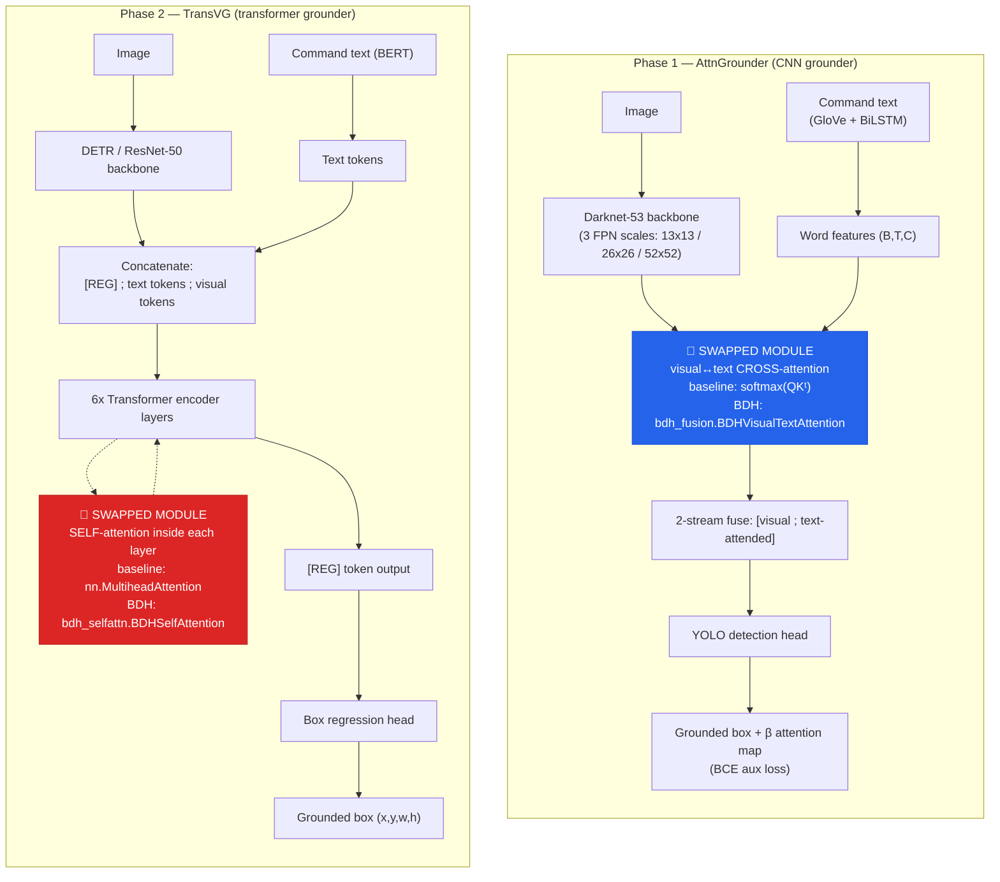
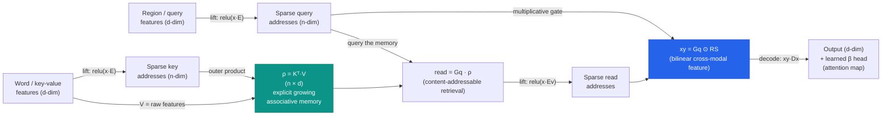
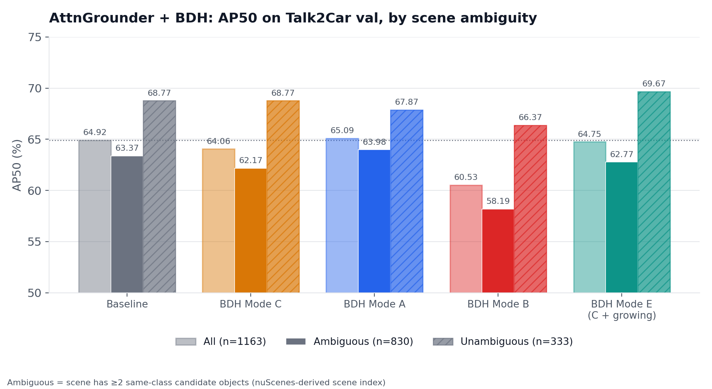
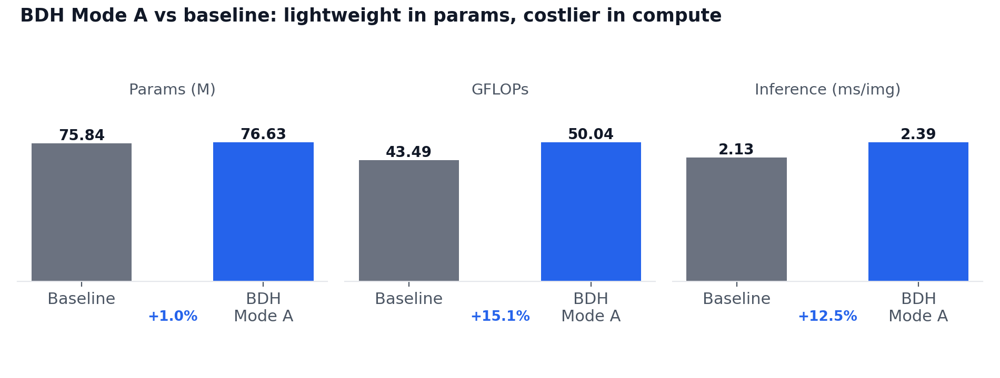
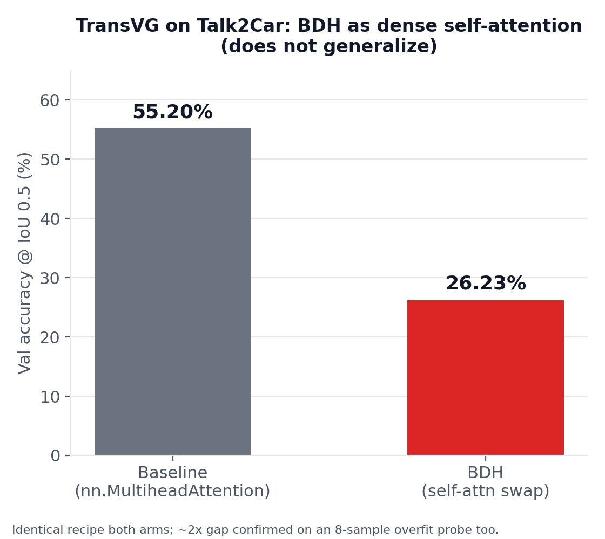

# Talk2Car-BDH

**Does the Dragon Hatchling (BDH) — a brain-inspired associative-memory architecture published in 2025 — work as a drop-in replacement for softmax attention on a real visual grounding benchmark?**

This repo swaps BDH's explicit, growing outer-product memory (`ρ = Kᵀ@V`) into two visual grounding architectures — [AttnGrounder](external/AttnGrounder) (CNN + cross-attention) and [TransVG](external/TransVG) (transformer self-attention) — and evaluates both against their original softmax-attention baselines on [Talk2Car](https://talk2car.github.io/), a natural-language object-grounding dataset for autonomous driving commands.

> **Headline result:** BDH is a **viable, near-drop-in replacement for narrow, well-scoped cross-attention** (comparable-to-modestly-better AP50, ~1% param overhead) — but this does **not** generalize to dense self-attention over long, visual-token-dominated sequences, where it lands at roughly half the baseline's accuracy. Both results are reported in full below; see [Findings](#findings--full-narrative) for the honest, non-cherry-picked story.

---

## Table of contents

- [Hypothesis](#hypothesis)
- [Architecture](#architecture)
  - [Pipeline: where BDH is swapped in](#pipeline-where-bdh-is-swapped-in)
  - [Inside the BDH module](#inside-the-bdh-module)
- [Results](#results)
  - [Phase 1 — AttnGrounder ablation](#phase-1--attngrounder-ablation-primary-study)
  - [Cost of the swap](#cost-of-the-swap)
  - [Phase 2 — TransVG cross-architecture check](#phase-2--transvg-cross-architecture-check)
- [Findings & full narrative](#findings--full-narrative)
- [Repository layout](#repository-layout)
- [Setup](#setup)
- [Usage](#usage)
- [Testing](#testing)
- [Papers / references](#papers--references)
- [Project status](#project-status)

---

## Hypothesis

> **"Grounding = in-context retrieval."** Architectures with an explicit, growing associative memory (BDH's outer-product `ρ = Kᵀ@V`) should show an AP50 advantage over standard softmax attention specifically on scenes with **multiple same-class candidate objects** ("ambiguous" scenes) — because disambiguating "the car" when there are three cars in frame is fundamentally a retrieval problem, not a compression problem (unlike, e.g., Mamba's fixed-size state).

This is tested by:
1. Building a **scene-ambiguity index** for Talk2Car val from nuScenes metadata (how many other same-class objects are in each scene), and
2. Stratifying AP50 by ambiguous vs. unambiguous scenes for baseline vs. BDH-swapped models, rather than just comparing aggregate AP50.

The hypothesis is **not supported** by the final evidence (see [Results](#results)) — but the project's value ended up being broader: an honest test of whether a brand-new (< 1 year old at the time of writing) architecture is *viable at all* as an attention replacement, and *where specifically* it is and isn't.

---

## Architecture

### Pipeline: where BDH is swapped in

Two independent architectures are used as hosts, each with BDH swapped into exactly one component so the comparison isolates the mechanism, not confounded by everything else changing too.



Both swaps keep everything else — backbone, text encoder, loss, training recipe — byte-for-byte identical between the baseline and BDH runs, so any AP50 / accuracy delta is attributable to the attention mechanism alone.

### Inside the BDH module

BDH's core idea: lift low-dim features into a **high-dimensional, ReLU-sparse, positive** address space (`n = mult × d`, `n ≫ d`), then read from an **explicit outer-product associative memory** instead of a normalized softmax distribution.



Three kernel variants were implemented and ablated for the AttnGrounder swap (`bdh_grounding/bdh_fusion.py`):

| Mode | Description | Result |
|---|---|---|
| **C** (primary) | Symmetric, non-causal. Regions query words directly. True drop-in for AttnGrounder's original `text_attn`. | Uniformly worse than baseline |
| **A** (ablation) | Words self-contextualize via a **causal** BDH pass first, *then* regions query the contextualized memory. | **Winner** — only config that trades unambiguous accuracy for ambiguous-scene gains, matching the hypothesis's predicted *shape* |
| **B** (ablation) | Single causal sequence `[words ; regions]`, vanilla-BDH style with RoPE + causal mask. | Clearly weakest — losing the words/regions distinction hurts |
| **E** (extension of C) | Cross-scale growing memory: each FPN scale's output becomes the next (finer) scale's region-feature prior. | Best absolute AP50, but still below baseline's own ambiguous-scene range |

For the TransVG swap, `bdh_grounding/bdh_selfattn.py` implements a signature-compatible drop-in for `nn.MultiheadAttention` (non-causal, mask-aware, no RoPE — position comes from TransVG's own learned embeddings), stacked once per of the 6 encoder layers.

---

## Results

### Phase 1 — AttnGrounder ablation (primary study)

Talk2Car val (n=1163: 830 ambiguous / 333 unambiguous, per the nuScenes-derived scene index in `analysis/build_scene_index.py`):



| Variant | AP50 (all) | AP50 (ambiguous) | AP50 (unambiguous) | Params |
|---|---|---|---|---|
| Baseline (AttnGrounder, unmodified) | 64.92 | 63.37 | 68.77 | 75.84M |
| BDH Mode C (symmetric, non-causal) | 64.06 | 62.17 | 68.77 | 76.63M |
| **BDH Mode A** (causal text-context → region query) | **65.09** | **63.98** | 67.87 | 76.63M |
| BDH Mode B (single causal sequence) | 60.53 | 58.19 | 66.37 | 76.63M |
| BDH Mode E (Mode C + cross-scale growing memory) | 64.75 | 62.77 | 69.67 | 76.63M |

Mode A was re-run across 3 seeds and stacked against baseline's own 2-seed variance range — of all 6 BDH configurations tested (3 kernel modes + seed replication + the growing-memory extension), **none clearly exceeds baseline's own observed ambiguous-scene range.** The disambiguation hypothesis does not hold up under multi-seed scrutiny; Mode A's single-seed result pointed the right direction but didn't replicate cleanly (see [FINDINGS.md](FINDINGS.md) for the full seed-by-seed table).

### Cost of the swap



BDH Mode A is lightweight in **parameters** (+1.0%) but meaningfully more expensive in **compute** (+15.1% GFLOPs — the high-dimensional sparse lift is not free) and measurably slower in **wall-clock inference** (+12.5%, measured on a contention-free A100 with two clean back-to-back runs). Report all three together — the flattering params number alone is misleading.

### Phase 2 — TransVG cross-architecture check

The same mechanism, ported to a structurally different host (transformer self-attention over `[REG] + 20 text + ~400 visual]` tokens per layer, instead of a narrow region↔word cross-attention):



| | Best val accuracy @ IoU 0.5 | Epoch |
|---|---|---|
| Baseline (`nn.MultiheadAttention`) | **55.20%** | 82 |
| BDH (self-attention swap) | **26.23%** | 82 |

A large, reproducible gap — confirmed independently on an 8-sample overfit probe (BDH plateaus at ~0.5–0.625 accuracy vs. baseline's clean convergence to 1.0), ruling out a training bug. **Plausible mechanism**: visual tokens outnumber text/REG tokens ~20:1 in the shared sequence, and BDH's unnormalized linear read (unlike per-token-normalized softmax attention) lets the visual majority dominate the pooled memory `ρ`, compounding across 6 stacked layers.

---

## Findings & full narrative

The two results above compose into the project's actual, scoped claim:

> BDH is a viable near-drop-in replacement for **narrow, well-scoped cross-attention** (region grid ↔ word sequence, AttnGrounder-style) — comparable-to-modestly-better AP50 with near-zero parameter overhead and zero task-specific tuning of the mechanism itself. It does **not** straightforwardly extend to **dense self-attention over long, heterogeneous token sequences** (TransVG-style V-L fusion) without further architectural adaptation (e.g. per-token normalization, or restricting which token types populate the memory).

This is deliberately framed as **viability**, not a leaderboard claim — the original "disambiguation advantage" hypothesis motivated the project but is honestly reported as **not supported** across every configuration tested. Both the positive (viability) and negative (disambiguation; TransVG self-attention) results are kept in the writeup; nothing is suppressed.

The full, dated research log — every experiment, dead end, bug hunt, and design decision, in the order it happened — lives in **[FINDINGS.md](FINDINGS.md)**. The living "resume work here" operational doc (environment setup, remote runbook, exact commands, current blockers) is **[STATUS.md](STATUS.md)**. A slide-deck summary is in [`slides/progress_update.pdf`](slides/progress_update.pdf), and a deeper study guide on the AttnGrounder mechanism specifically is in [`slides/bdh_report.pdf`](slides/bdh_report.pdf).

---

## Repository layout

```
Talk2Car BDH/
├── bdh_grounding/          # The actual BDH module (the deliverable)
│   ├── bdh_fusion.py       #   BDHVisualTextAttention — AttnGrounder swap (modes A/B/C + growing-scales)
│   ├── bdh_selfattn.py     #   BDHSelfAttention — TransVG swap (nn.MultiheadAttention-compatible)
│   ├── pipeline.py         #   config→args, bf16 autocast, CSV logger, checkpoint/resume, Tversky+Focal loss
│   └── INTEGRATION.md      #   exact 3-edit patch for wiring BDH into grounding_model.py
├── train.py                # config-driven trainer/evaluator for AttnGrounder + BDH (--eval-only, --variant, ...)
├── configs/                # smoke_local.yaml (CPU smoke) / full_a100.yaml (real training)
├── analysis/                # scene-ambiguity index, stratified eval, metrics collection
│   ├── build_scene_index.py     #   Talk2Car + nuScenes → per-image same-class-object counts
│   ├── stratified_eval.py       #   AP50 split into ambiguous / unambiguous / unknown
│   └── measure_metrics.py       #   params / layer count / GFLOPs / inference-ms / FPS
├── arch3/                  # TransVG cross-architecture port tooling
│   ├── build_transvg_talk2car.py  # Talk2Car → TransVG's 5-tuple data format
│   ├── overfit_test.py            # 8-sample memorization probe (bug-vs-recipe localizer)
│   └── diagnose_talk2car_transvg.py
├── arch2/                  # Scoped-but-not-yet-built: Distractor-Contrastive Loss idea
├── external/                # Reference repos (read-only; not run locally)
│   ├── AttnGrounder/            #   host architecture, Phase 1
│   ├── TransVG/                 #   host architecture, Phase 2
│   └── bdh/                     #   pathwaycom/bdh — ground-truth BDH reference implementation
├── tests/                  # CPU-only unit tests (module contracts, config parsing, checkpoint roundtrip, ...)
├── papers/                 # Markdown-extracted source papers (BDH, AttnGrounder, ThinkDeeper, IRRA)
├── slides/                 # Beamer progress-update deck + BDH mechanism study guide
├── FINDINGS.md             # Full dated research log (the real "paper" of this project)
├── STATUS.md               # Operational resume-here doc: environment, remote runbook, commands
└── assets/                 # Generated result charts (this README)
```

---

## Setup

This project has an unusual split: code is authored on a local Apple-silicon Mac (**no CUDA**) and synced to a remote A100 machine for all real training/eval. All of it is config-driven so the exact same code runs CPU-only locally (for tests/smoke) or on GPU remotely (for real numbers).

```bash
# clone recursively is not needed — external/ repos are already vendored in-tree
pip install torch torchvision numpy pyyaml
# TransVG phase additionally needs:
pip install pytorch_pretrained_bert nuscenes-devkit fvcore
```

- **Local**: CPU-only smoke tests and code authoring. `configs/smoke_local.yaml` runs in fp32 on a tiny subset.
- **Remote (A100)**: real training. `configs/full_a100.yaml` runs bf16 mixed precision at the paper's batch size (14) for 100 epochs. See [STATUS.md](STATUS.md) for the exact sync/tmux/checkpoint workflow.

Data: Talk2Car commands + Talk2CarSlim images + AttnGrounder's `corpus.pth` (GloVe vocab), plus nuScenes `v1.0-trainval` **metadata-only** (~0.45GB, not the 300GB sensor blobs) for the scene-ambiguity index. See `analysis/build_scene_index.py` docstring for the exact nuScenes token-lookup gotcha (Talk2Car's `sample_token` is actually a `sample_data` token, not a `sample` token).

---

## Usage

```bash
# AttnGrounder — train the baseline
python train.py --config configs/full_a100.yaml --variant baseline

# AttnGrounder — train BDH Mode A (the ablation winner)
python train.py --config configs/full_a100.yaml --variant bdh --bdh-mode A

# AttnGrounder — eval-only against a checkpoint (reports AP50 + inference-ms + params)
python train.py --config configs/full_a100.yaml --variant bdh --bdh-mode A \
    --eval-only --resume checkpoints/full/bdh_A_best.pth.tar

# Stratified eval (the actual hypothesis test: ambiguous vs unambiguous AP50)
python analysis/stratified_eval.py --config configs/full_a100.yaml --variant bdh --bdh-mode A \
    --resume checkpoints/full/bdh_A_best.pth.tar --scene-index analysis/scene_index_val.json

# TransVG — baseline vs BDH self-attention (from external/TransVG, see STATUS.md for full runbook)
python train.py --dataset talk2car --data_root ./data --split_root ./data \
    --detr_model ./checkpoints/detr-r50.pth --vl_attn_type mha  --batch_size 32 --epochs 90 ...
python train.py --dataset talk2car --data_root ./data --split_root ./data \
    --detr_model ./checkpoints/detr-r50.pth --vl_attn_type bdh --bdh_mult 4 --batch_size 32 --epochs 90 ...
```

Useful CLI overrides on `train.py`: `--seed` (multi-seed reruns), `--growing-scales` (Mode E), `--map-loss tversky_focal`, `--text-encoder distilbert` (offline pretrained-text ablation). Full flag list in `train.py:main()`.

---

## Testing

All CPU-testable — run before syncing any local change to the remote GPU box:

```bash
python3 tests/smoke_test.py          # BDH module contract: all FPN scales, all 3 modes, grad flow, params
python3 tests/integration_smoke.py   # BDH swap + 2-stream fusion -> mock YOLO head, shape-verified
python3 tests/plumbing_test.py       # config parsing, CSV logger, checkpoint roundtrip, subset/anchors
python3 tests/stratify_logic_test.py # Step 6 ambiguity-bucketing math + category matching (synthetic data)
python3 tests/text_encoder_test.py   # offline DistilBERT text-cache path
python3 tests/measure_metrics_test.py # layer-counting correctness
python3 tests/transvg_bdh_test.py    # BDHSelfAttention: nn.MultiheadAttention signature/shape parity,
                                      #   key_padding_mask zero-leakage, init preservation, backprop
```

---

## Papers / references

- **BDH**: Kosowski, Uznański, Chorowski, Stamirowska, Bartoszkiewicz. *The Dragon Hatchling: The Missing Link between the Transformer and Models of the Brain.* arXiv:2509.26507, 2025. ([`papers/2509.26507v1.md`](papers/2509.26507v1.md), reference impl in [`external/bdh/`](external/bdh))
- **AttnGrounder**: Mittal. *AttnGrounder: Talking to Cars with Attention.* ([`papers/attngrounder.md`](papers/attngrounder.md), reference impl in [`external/AttnGrounder/`](external/AttnGrounder))
- **TransVG**: Deng et al. *TransVG: End-to-End Visual Grounding with Transformers.* ICCV 2021. (reference impl in [`external/TransVG/`](external/TransVG))
- **ThinkDeeper**: Liao et al. *Think Before You Drive: World Model-Inspired Multimodal Grounding for Autonomous Vehicles.* ([`papers/thinkdeeper.md`](papers/thinkdeeper.md)) — SOTA comparison point and the source of the "Shaking-Up-VLMs" in-context-retrieval framing this project tests.
- **Talk2Car**: the benchmark dataset — natural-language commands for object grounding on nuScenes driving scenes.

---

## Project status

Both experimental phases (AttnGrounder ablation, TransVG cross-architecture check) are **closed** per an explicit, pre-committed stopping rule (see FINDINGS.md, "DECIDED 2026-07-21: AttnGrounder stopping criterion"). Deferred, not-yet-built future work: the Distractor-Contrastive Loss idea (`arch2/`), a BDH→attention hybrid ("Mode D"), and multi-head BDH. See [STATUS.md](STATUS.md) for the exact current state and [FINDINGS.md](FINDINGS.md) for why each was deferred rather than pursued.
